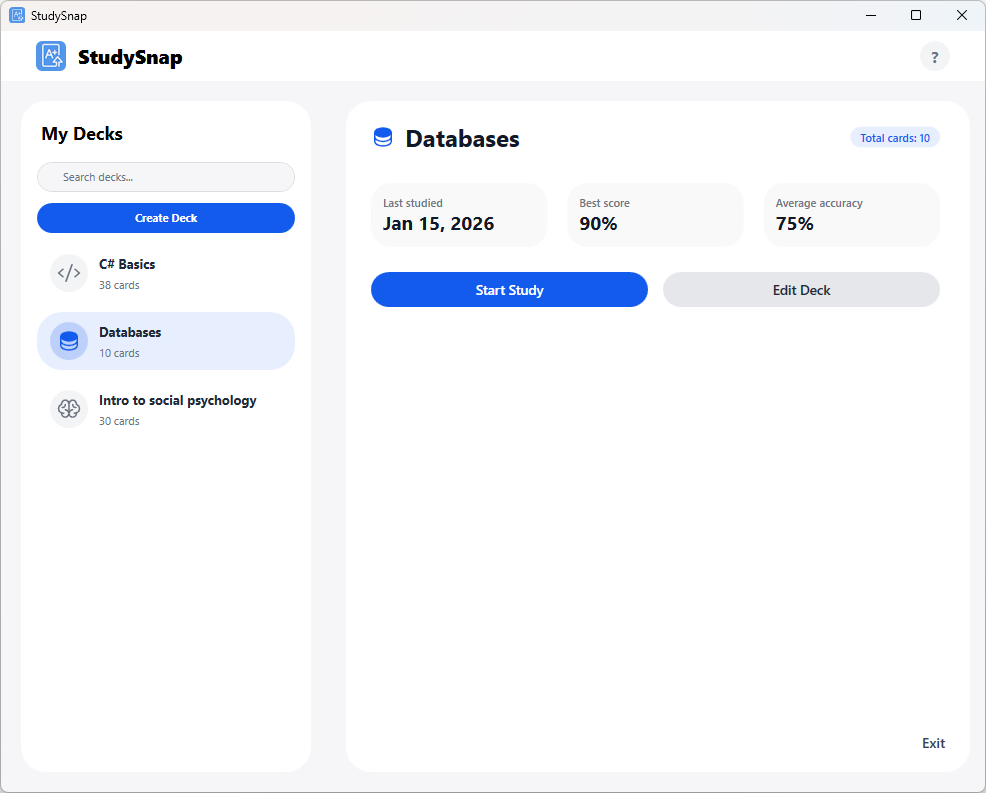
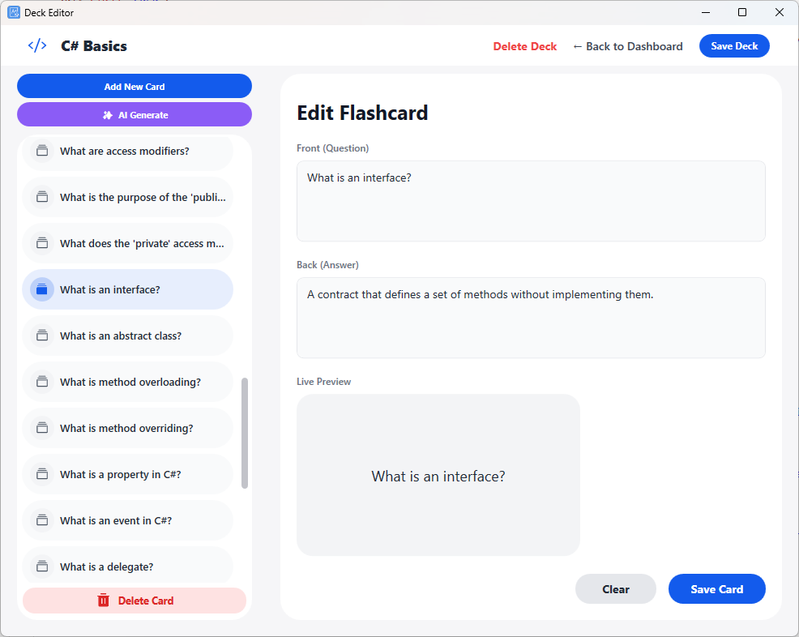
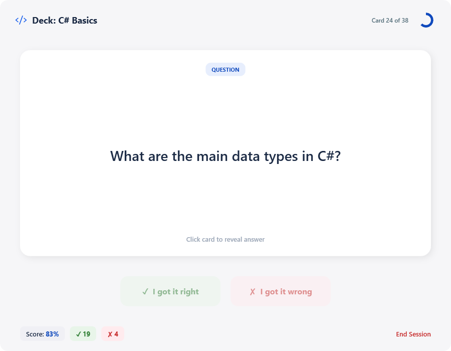

#  StudySnap

StudySnap is a study and quiz application that helps students review and retain concepts through flashcards, quizzes, and structured study sessions. It began as a school project and is now continued as an independent personal project.

---

## Features

- Create and manage flashcard decks  
- Study mode for reviewing concepts  
- Progress tracking and session history  
- AI-assisted flashcard creation with file upload  
- Search and filter decks  
- Local data persistence  

---

## Deck Editor

Create, edit, and manage individual flashcards with live preview and fast editing tools.

---

## Study Mode

Study decks using an interactive flashcard system with score tracking and session feedback.

---

## Tech Stack

- Language: C#  
- Framework: WPF  
- Data: JSON-based local storage  
- Architecture: Object-oriented design  

---

## Download

You can download the latest Windows build here:

[Download StudySnap for Windows](https://github.com/metergames/study-snap/releases/latest)

Steps:
1) Download the ZIP file  
2) Extract it  
3) Run `StudySnap.exe`  

---

## Project Status

This project is actively being improved. Planned work includes:
- UI and UX refinements  
- Performance optimizations  
- Improved analytics and insights  
- Cloud sync and backup  
